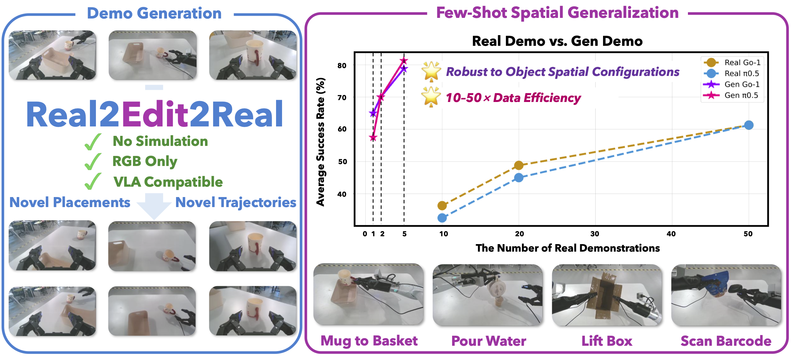
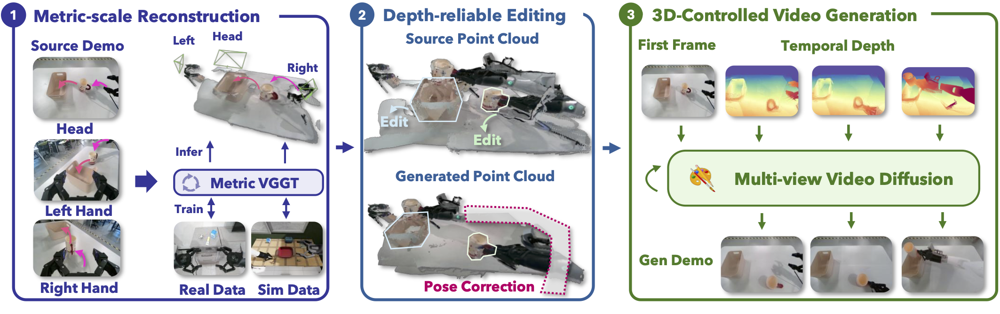

# Real2Edit2Real: Generating Robotic Demonstrations via a 3D Control Interface
<div align="center">
  <p>
    <a href="https://github.com/ZhaoYujie2002">Yujie Zhao<sup>1,2</sup>*</a>,
    <a href="https://hwfan.io/about-me/">Hongwei Fan<sup>1,2</sup>*</a>,
    <a href="https://scholar.google.com/citations?user=Ht9e9D4AAAAJ&hl=en">Di Chen<sup>3</sup></a>,
    <a href="https://scholar.google.com/citations?user=C8tdixEAAAAJ&hl=en">Shengcong Chen<sup>3</sup></a>,
    <a href="https://scholar.google.com/citations?user=TivepIgAAAAJ&hl=en">Liliang Chen<sup>3</sup></a>,
    <a href="https://clorislili.github.io/clorisLi/">Xiaoqi Li<sup>1,2</sup></a>,
    <a href="https://scholar.google.com/citations?user=oqN1dA8AAAAJ">Guanghui Ren<sup>3</sup></a>,
    <a href="https://zsdonghao.github.io/">Hao Dong<sup>1,2</sup></a>,
  </p>
  <p>
    <span><sup>1</sup>CFCS, School of Computer Science, Peking University,</span>
    <span><sup>2</sup>PKU-AgiBot Lab,</span>
    <span><sup>3</sup>AgiBot</span>
  </p>
</div>
<div align="center">
  (* indicates equal contribution)
</div>

<div align="center">
  <strong>CVPR 2026</strong>
</div>

<div align="center">
<!--
<a href="https://jytime.github.io/data/VGGT_CVPR25.pdf" target="_blank" rel="noopener noreferrer">
  
</a>
-->
<a href="https://arxiv.org/abs/2512.19402">
  
</a>
<a href="https://real2edit2real.github.io/">
  
</a>
<!--
<a href="https://drive.google.com/drive/folders/1bHzv8e69NHseEj-3Qe0k0GqTmDYMGg-K?usp=sharing">
  
</a>
</div>
-->

<p align="center">
    
</p>
</div>

This repository contains the official authors implementation associated with the paper "Real2Edit2Real: Generating Robotic Demonstrations via a 3D Control Interface".



## 📢 News
- **Mar &nbsp;10, 2026:** We released the code and the model weights.
- **Feb 21, 2026:** Real2Edit2Real has been accepted by CVPR 2026. 🥳🥳
- **Dec 22, 2025:** We released the [arXiv](https://arxiv.org/abs/2512.19402) and [demo](https://real2edit2real.github.io/) of Real2Edit2Real.

## 🛠️ Installation

```bash
conda create -y -n r2e2r python=3.10
conda activate r2e2r
conda install -y nvidia/label/cuda-12.1.0::cuda-toolkit -c nvidia/label/cuda-12.1.0
conda install -y -c conda-forge gxx_linux-64=11.4 gcc_linux-64=11.4 aria2
bash scripts/installation/1_install_env.sh
bash scripts/installation/2_install_curobo.sh
# Set this flag if you experience slow download speeds:
# export USE_HF_MIRROR=true
bash scripts/installation/3_download_ckpts.sh
```

## 🔥 Quick Start
The data generation pipeline illustrated below is capable of running on an **NVIDIA GeForce RTX 4090**.

### Downloading Example Data

```bash
# Set this flag if you experience slow download speeds:
# export USE_HF_MIRROR=true
bash scripts/installation/3_download_data.sh
```

### Metric-scale Geometry Reconstruction

```bash
bash scripts/preprocess_demo.sh --config-path configs/mug_to_basket.yaml
```

### Depth-reliable Spatial Editing

```bash
bash scripts/generate_demo.sh --config-path configs/mug_to_basket.yaml
```

### 3D-Controlled Video Generation

```bash
bash scripts/generate_demo_video.sh --config-path configs/mug_to_basket.yaml
```

## 🔥 Training
The training scripts illustrated below are capable of running on **GPUs with 80GB VRAM**.

### Metric-VGGT Training

1. Preparing the dataset

```
Dataset
- task-id
-- episode-id
--- frame-id
---- head_color
---- hand_left_color
---- hand_right_color
---- head_depth
---- hand_left_depth
---- hand_right_depth
---- head_extrinsic
---- hand_left_extrinsic
---- hand_right_extrinsic
---- head_intrinsic
---- hand_left_intrinsic
---- hand_right_intrinsic
```

2. Downloading the pretrained VGGT

```bash
wget https://huggingface.co/facebook/VGGT-1B/resolve/main/model.pt -O checkpoints/vggt_base_model.pt
```

3. Run the training script

```bash
cd vggt
bash train.sh
```

### Video Generation Model Training
For training data, we use the metric-VGGT model to annotate the open-source dataset [AgibotWorld-Beta](https://huggingface.co/datasets/agibot-world/AgiBotWorld-Beta) with depth and camera pose labels. 

We provide a reference data processing script: **vggt/preprocess_agibot_dataset.py**

1. Preparing the dataset

```
Dataset
- observations
-- task-id
---episode-id
- parameters
- proprio_stats

Annotated-Result
- task-id
-- episode-id
--- head_depth_ori
--- hand_left_depth_ori
--- hand_right_depth_ori
--- head_depth_canny
--- hand_left_depth_canny
--- hand_right_depth_canny
--- head_extrinsic.npy
--- hand_left_extrinsic.npy
--- hand_right_extrinsic.npy

```

2. Downloading the pretrained GE-Sim

```bash
wget https://modelscope.cn/models/agibot_world/Genie-Envisioner/resolve/master/ge_sim_cosmos_v0.1.safetensors -O checkpoints/ge_sim_cosmos_v0.1.safetensors
```

3. Training

```bash
cd videogen
bash train.sh scripts/train_action_depth_canny_cosmos2.py --config_file configs/action_depth_canny_cosmos2.yaml
```

## 🧩 Acknowledgements

Thanks to these great repositories: [DUSt3R](https://github.com/naver/dust3r), [MASt3R](https://github.com/naver/must3r), [VGGT](https://github.com/facebookresearch/vggt), [DemoGen](https://github.com/TEA-Lab/DemoGen), [Cosmos](https://github.com/nvidia-cosmos/cosmos-predict2), [GenieEnvisioner](https://github.com/AgibotTech/Genie-Envisioner), [Enerverse-AC](https://github.com/AgibotTech/EnerVerse-AC), and many other inspiring works in the community.

## ✍️ Citation

```bibtex
@article{zhao2025real2edit2real,
      title={Real2Edit2Real: Generating Robotic Demonstrations via a 3D Control Interface}, 
      author={Yujie Zhao and Hongwei Fan and Di Chen and Shengcong Chen and Liliang Chen and Xiaoqi Li and Guanghui Ren and Hao Dong},
      year={2025},
      eprint={2512.19402},
      archivePrefix={arXiv},
      primaryClass={cs.RO},
      url={https://arxiv.org/abs/2512.19402}, 
}
```